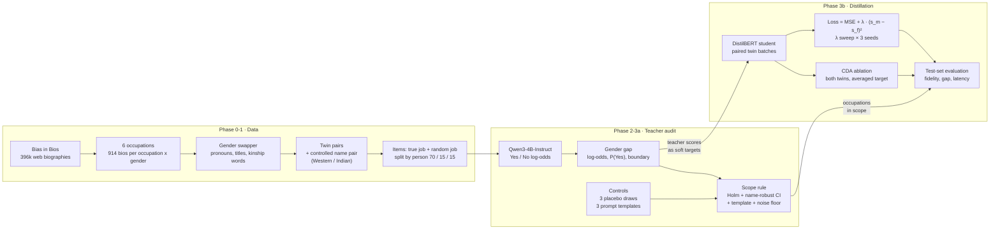

# Who Gets Hired?
### Auditing and distilling gender bias in an LLM résumé screener


Companies increasingly use large language models to screen job applications. This project asks three questions:

1. **Does an LLM screener score two otherwise-identical candidates differently because of gender?**
2. **When the screener is distilled into a small, CPU-friendly model, does the bias carry over?**
3. **Can the bias be trained out of the small model, and at what cost?**

The method is a *counterfactual audit*. Every biography is turned into a pair of "twins" that differ only in gender cues (pronouns, titles, kinship words and first name), and both twins are scored by the model. Any difference between the twins' scores can only come from gender.

> **Plain-language write-up:** [findings-explained.md](findings-explained.md) explains the whole study and every statistical term for a non-technical reader.

---

## Key results

| | Finding |
|---|---|
| **Screener quality** | Qwen3-4B separates suitable from unsuitable candidates with **AUC 0.946** |
| **Gender bias** | A robust bias in **one of six occupations**. For an identical **nurse** bio, the female version's odds of being shortlisted are **×3.4** (+1.22 log-odds, 95% CI 0.98–1.46). No robust gap in software engineering, architecture, dentistry, teaching or psychology. |
| **Decision impact** | Mostly a confidence effect: decisions flip in **2.7%** of nurse pairs. On *borderline* nurse cases the female twin's odds are about **×39**. |
| **Robustness** | The nurse effect holds across three prompt wordings and clears a placebo noise floor (same-gender name swaps). Indian and Western names give the same gap. |
| **Distillation** | A DistilBERT student (66M params, Pearson **0.91** with the teacher) **inherits the bias fully**: student/teacher gap ratio ≈ 1.1. |
| **Mitigation** | Counterfactual data augmentation removes **~89% of the pooled gap and ~98% of the nurse gap at zero AUC cost**. A consistency loss (λ = 0.5) removes ~70%. |

<p align="center">
  
  
</p>
<p align="center"><sub><b>Left:</b> teacher gender gap per occupation (blue), against the same-gender name-swap placebo (grey). <b>Right:</b> student gap vs. AUC across mitigation strengths.</sub></p>

---

## How it works



**Pipeline in brief**

| Phase | Notebook | What it does | Gate |
|---|---|---|---|
| 0 | `phase0_feasibility` | Validates the dataset and labels, picks occupations, checks the teacher runs on a T4 | GO |
| 1 | `phase1_data_eval_setup` | Builds and audits the gender counterfactuals, makes the splits, freezes the prompts and metrics | PASS |
| 2 | `phase2_pilot` | End-to-end pilot on 1,008 bios: scoring, bias audit, TF-IDF student | PASS |
| 3a | `phase3a_teacher_audit` | Full audit: 64,032 prompts, placebo noise floor, template robustness, scopes | PASS |
| 3b | `phase3b_student_distillation` | Distillation, λ sweep, CDA ablation, test evaluation, CPU latency | 5 / 7 checks* |

<sub>*3b missed two pre-set engineering targets: the margin over TF-IDF (0.076 against a 0.10 target) and float32 CPU latency (60 ms against 50 ms; 36 ms with int8 quantisation). Both hypotheses were supported. The thresholds were left as set before the run.</sub>

---

## Methodology highlights

- **Pre-registered:**
  - Hypotheses (H1–H3), metrics, prompts and pass/fail gates were fixed before any model results.
  - Failed checks are reported, not re-tuned.
- **Counterfactual twins:**
  - A POS-aware swapper handles cases like *her* → *his*/*him*.
  - Organisation names ("Brigham and Women's Hospital"), job-content words ("women's health") and the degree "MS" are left untouched.
  - Leftover gender cues and residual real names are detected automatically and those bios are dropped.
- **Log-odds scoring:**
  - The score is `logsumexp(Yes logits) − logsumexp(No logits)` from raw float32 logits, in one forward pass with no generation.
  - P(Yes) saturates near 0 and 1, so it can't separate candidates. It is reported alongside, together with the decision flip rate.
- **Uncertainty done carefully:**
  - Cluster bootstrap over bios.
  - A *name-robust* crossed bootstrap over bios × first names, because there are only 20 names per bank.
  - Holm correction across occupations.
- **Noise floor:**
  - Three balanced same-gender name-swap placebos, scored in the same GPU batch as the originals, measure how much scores move with no gender change at all.
- **Leakage-safe evaluation:**
  - Splits are by person.
  - The student's clip range, standardisation, epoch and λ are all chosen on train or val.
  - The test split is read once, in the final cell.

---

## Repository structure

```
.
├── notebooks/
│   ├── phase0_feasibility.ipynb
│   ├── phase1_data_eval_setup.ipynb
│   ├── phase2_pilot.ipynb
│   ├── phase3a_teacher_audit.ipynb
│   ├── phase3b_student_distillation.ipynb
│   └── kaggle_ran_notebooks/          # the same notebooks as executed on Kaggle, with outputs
│       ├── nbk_phase0.ipynb  nbk_phase1.ipynb  nbk_phase2.ipynb
│       └── nbk_phase3a.ipynb  phase-3b.ipynb
├── src/
│   ├── swap.py                        # gender counterfactual swapper (spaCy)
│   ├── prompts.py                     # frozen prompt templates A / B / C
│   ├── teacher.py                     # LLM scoring: Yes/No log-odds from raw logits
│   ├── metrics.py                     # frozen metrics: paired gap, bootstrap, permutation, Holm
│   ├── audit.py                       # name-robust bootstrap, balanced placebo, three-scale tables
│   └── student.py                     # paired dataset, consistency loss, training loop
├── configs/, data/, results/          # empty working folders; each notebook writes its outputs here
├── assets/                            # charts used in this README
├── findings-explained.md              # plain-language write-up of the study
└── requirements.txt
```

**Where to look first:** the executed notebooks in [`notebooks/kaggle_ran_notebooks/`](notebooks/kaggle_ran_notebooks) show every printed table, chart and gate verdict. The headline results are at the end of [`nbk_phase3a.ipynb`](notebooks/kaggle_ran_notebooks/nbk_phase3a.ipynb) (teacher audit) and [`phase-3b.ipynb`](notebooks/kaggle_ran_notebooks/phase-3b.ipynb) (distillation).

Each notebook's full output can be regenerated on Kaggle (see below), so the output files themselves aren't stored in the repository:
- `configs/`: settings and decisions
- `results/`: the `phaseN_summary.md` report, tables and charts
- `data/processed/`: scored datasets

---

## Reproducing the results

Every phase is a self-contained Kaggle notebook. Each one writes its own `src/*.py` with `%%writefile`, so nothing has to be uploaded.

1. Import the phase's notebook on Kaggle (*File → Import notebook*).
2. Turn **Internet on** and pick the accelerator named in the first cell (GPU T4 ×2 for phases 0, 2, 3a and 3b; CPU for phase 1).
3. Attach the earlier phases' output datasets with *Add Input*: `gb-phase0` → `gb-phase1` → `gb-phase2` → `gb-phase3a`.
4. *Run all*, then *Save Version* and publish the output as the next dataset.

| Phase | Approx. runtime |
|---|---|
| 0 | ~30 min (GPU) |
| 1 | ~30 min (CPU) |
| 2 | ~15 min (GPU) |
| 3a | ~2 h (GPU) |
| 3b | ~3 h (GPU) |

To read the Kaggle parquet outputs locally you need `pyarrow >= 20`. For local analysis:

```bash
pip install -r requirements.txt
```

---

## Limitations

- **One teacher model** (Qwen3-4B-Instruct). Other models may behave differently.
- **Prompt sensitivity:** the nurse effect is robust in direction, but its size ranges from ×3.5 to ×20 in odds across prompt wordings.
- **Only one strongly female-dominated occupation** (nurse, 91%). The study can't separate "nursing" from "very female-dominated jobs" in general.
- **Binary gender only.** The bios are web-scraped, and about 27% of candidates were dropped to keep the twins clean.
- **Counterfactual-pair quality** was checked by an automated audit and a 50-pair hand read.

A fuller discussion is in [findings-explained.md](findings-explained.md#12-what-this-study-does-and-doesnt-show).

---

## Documentation

| Document | Purpose |
|---|---|
| [findings-explained.md](findings-explained.md) | The study explained for non-technical readers, with every statistical term defined |
| [Phase 3a notebook (executed)](notebooks/kaggle_ran_notebooks/nbk_phase3a.ipynb) | Teacher audit: gaps on three scales, placebo noise floor, template robustness, exit gate |
| [Phase 3b notebook (executed)](notebooks/kaggle_ran_notebooks/phase-3b.ipynb) | Distillation: fidelity, λ sweep, CDA ablation, hypothesis verdicts, latency, exit gate |
| [`notebooks/kaggle_ran_notebooks/`](notebooks/kaggle_ran_notebooks) | All executed notebooks (phases 0–3b), with every printed output |

## Tech stack

Python · PyTorch (fp16 autocast) · Hugging Face Transformers · spaCy (`en_core_web_lg`) · scikit-learn · SciPy · pandas · NLTK · Kaggle T4 GPUs

## Acknowledgements

- **Dataset:** *Bias in Bios*. De-Arteaga et al., "Bias in Bios: A Case Study of Semantic Representation Bias in a High-Stakes Setting", FAT\* 2019 (`LabHC/bias_in_bios` on Hugging Face).
- **Models:** [Qwen3-4B-Instruct-2507](https://huggingface.co/Qwen/Qwen3-4B-Instruct-2507) and [DistilBERT](https://huggingface.co/distilbert-base-uncased).
